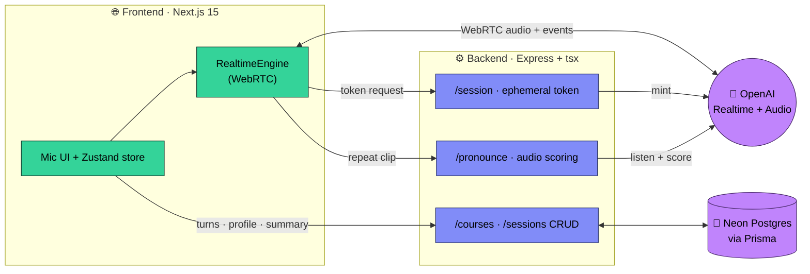
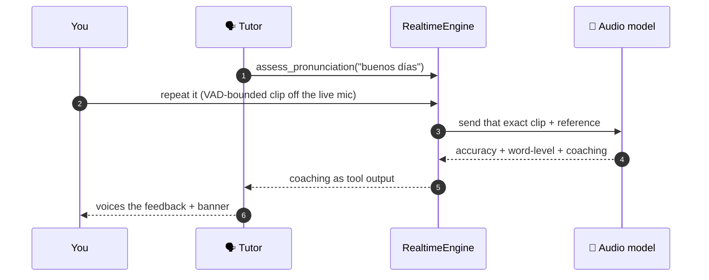

<!-- ═══════════════════════════════════════════════════════════════════════ -->
<!--                                 HEADER                                    -->
<!-- ═══════════════════════════════════════════════════════════════════════ -->

<div align="center">


<br />

<a href="https://readme-typing-svg.demolab.com">
  
</a>

<br /><br />

<a href="https://christopherai.vercel.app/">
  
</a>

<br /><br />

<!-- ── Badges ─────────────────────────────────────────────────────────────── -->


<br />


<br /><br />

<!-- ── Quick nav ──────────────────────────────────────────────────────────── -->

<b>
<a href="#-why-christopher">Why</a> &nbsp;•&nbsp;
<a href="#-features">Features</a> &nbsp;•&nbsp;
<a href="#-architecture">Architecture</a> &nbsp;•&nbsp;
<a href="#-quick-start">Quick Start</a> &nbsp;•&nbsp;
<a href="#-configuration">Config</a> &nbsp;•&nbsp;
<a href="#-deploy">Deploy</a> &nbsp;•&nbsp;
<a href="#-roadmap">Roadmap</a>
</b>

</div>


<!-- ═══════════════════════════════════════════════════════════════════════ -->
<!--                                  WHY                                      -->
<!-- ═══════════════════════════════════════════════════════════════════════ -->

 **Note:** This project was originally developed in **Jul 2026**. I am publishing it here in **Aug 2026** as part of sharing my past work.

## ✦ Why Christopher

Language apps make you tap flashcards. **Christopher makes you _talk_.**

It's a tutor you speak to out loud - like a real teacher. You have a live, natural
voice conversation; it listens to your actual pronunciation, scores it phrase by
phrase, tells you exactly what to adjust, and remembers you next time. No levels to
pick, no gates to unlock - it adapts on its own as you improve.

> **The core loop:** _talk → get coached on the exact clip you just said → the tutor
> voices the feedback → your progress is remembered._


<!-- ═══════════════════════════════════════════════════════════════════════ -->
<!--                                FEATURES                                   -->
<!-- ═══════════════════════════════════════════════════════════════════════ -->

## ⚡ Features

|            | Capability | What it does |
| :--------: | :--------- | :----------- |
| 🎙️ | **Live voice conversation** | Full-duplex WebRTC straight from the browser to OpenAI Realtime, secured with ephemeral tokens. |
| 🗣️ | **Real pronunciation scoring** | You repeat a phrase; the audio model listens to *that exact clip* and returns accuracy + targeted coaching. |
| 🧠 | **Stateful memory** | The tutor learns your name, native language, and level - persisted to Postgres and injected back on return. |
| 👋 | **Welcome back** | Reopens where you left off and greets returning learners by name. |
| 📊 | **End-of-session summary** | On stop, an LLM distills the transcript into vocabulary, recurring mistakes, grammar tips, and a next lesson. |
| 📚 | **Auto-building vocabulary** | Every scored phrase feeds your growing word bank per language. |
| 🌍 | **180+ languages** | Searchable, ISO 639 selector powered natively by `Intl.DisplayNames`. |
| ⏱️ | **Deterministic turn-taking** | The client drives `response.create`, so no double-replies or crosstalk. |
| 🔐 | **Guest-first, auth-optional** | Works instantly as an anonymous guest; Clerk sign-in is a drop-in upgrade. |


<!-- ═══════════════════════════════════════════════════════════════════════ -->
<!--                              ARCHITECTURE                                 -->
<!-- ═══════════════════════════════════════════════════════════════════════ -->

## 🏗 Architecture

A tidy npm-workspaces monorepo. Every model call is behind a **swappable seam** - the
`ConversationEngine` interface lets Phase 2 drop in a custom `STT → LLM → TTS` pipeline
without touching the UI.



### Project layout

```text
Voice Agent/
├── shared/      @vta/shared — Zod schemas + shared TS types (raw TS, no build)
├── backend/     Express — /session, /pronounce, /courses & /sessions CRUD (Prisma → Neon)
│   └── src/routes/         one file per concern; the pronounce route is the scoring seam
└── frontend/    Next.js 15 — RealtimeEngine (WebRTC), Zustand store, premium mic UI
    ├── components/         Landing, Home, SessionView, modals…
    └── lib/engine/         ConversationEngine seam (Realtime today, custom pipeline later)
```


<!-- ═══════════════════════════════════════════════════════════════════════ -->
<!--                               TECH STACK                                  -->
<!-- ═══════════════════════════════════════════════════════════════════════ -->

## 🧩 Tech Stack

| Layer | Choices |
| :---- | :------ |
| **Frontend** | Next.js 15 · React 19 · Zustand · Tailwind CSS 4 · WebRTC |
| **Backend** | Express · tsx (no compile step) · Multer · Zod |
| **AI** | OpenAI Realtime (voice) · `gpt-4o-mini-audio-preview` (pronunciation) · `gpt-4o-mini` (summaries) |
| **Data** | Prisma ORM · Neon Postgres |
| **Auth** | Clerk _(optional - guest-first by default)_ |
| **Shared** | `@vta/shared` workspace - Zod contracts across the wire |


<!-- ═══════════════════════════════════════════════════════════════════════ -->
<!--                              QUICK START                                  -->
<!-- ═══════════════════════════════════════════════════════════════════════ -->

## 🚀 Quick Start

> **Prerequisites** - Node 18+, an **OpenAI** key with Realtime + audio access, and a
> **Neon** Postgres connection string.

```bash
# 1 · Install (npm workspaces - once, from the repo root)
npm install

# 2 · Environment
cp .env.example backend/.env                                   # add OPENAI_API_KEY + DATABASE_URL
printf 'NEXT_PUBLIC_BACKEND_URL=http://localhost:8787\n' > frontend/.env.local

# 3 · Database (Neon)
npm run prisma:generate --workspace=backend
npm run prisma:push     --workspace=backend                    # create tables

# 4 · Run — two terminals
npm run dev:backend      # → http://localhost:8787
npm run dev:frontend     # → http://localhost:3000
```

<div align="center">
<br />
Open <b><a href="http://localhost:3000">localhost:3000</a></b> → tap <b>Speak</b> → say hello. 👋
<br /><br />
</div>


<!-- ═══════════════════════════════════════════════════════════════════════ -->
<!--                             CONFIGURATION                                 -->
<!-- ═══════════════════════════════════════════════════════════════════════ -->

## 🔧 Configuration

<details open>
<summary><b><code>backend/.env</code></b></summary>

| Variable | Required | Description |
| :------- | :------: | :---------- |
| `OPENAI_API_KEY` | ✅ | Key with Realtime + audio access. |
| `DATABASE_URL` | ✅ | Neon Postgres connection string. |
| `OPENAI_REALTIME_MODEL` | - | Voice model. Default `gpt-realtime-mini`. |
| `OPENAI_REALTIME_VOICE` | - | Voice preset. Default `alloy`. |
| `OPENAI_PRONUNCIATION_MODEL` | - | Audio scorer. Default `gpt-4o-mini-audio-preview`. |
| `OPENAI_SUMMARY_MODEL` | - | Summary LLM. Default `gpt-4o-mini`. |
| `FREE_SESSIONS` / `FREE_SECONDS` | - | Per-owner free-trial gate. Defaults `1` / `60`. |
| `FRONTEND_ORIGIN` | - | CORS origin. Default `http://localhost:3000`. |
| `CLERK_SECRET_KEY` | - | Omit to run guest-only. |

</details>

<details>
<summary><b><code>frontend/.env.local</code></b></summary>

| Variable | Required | Description |
| :------- | :------: | :---------- |
| `NEXT_PUBLIC_BACKEND_URL` | ✅ | Backend base URL. |
| `NEXT_PUBLIC_CLERK_PUBLISHABLE_KEY` | - | Enables the Sign-in button. Omit for guest-only. |

</details>

### Scripts

| Command | Runs |
| :------ | :--- |
| `npm run dev:backend` | Express API with hot reload |
| `npm run dev:frontend` | Next.js dev server |
| `npm run build` | Build all workspaces |
| `npx tsx backend/src/pronounce.selfcheck.ts` | Coaching-threshold self-check - _no keys/DB needed_ |
| `npx tsx frontend/lib/recorder.selfcheck.ts` | Audio downsample + PCM self-check - _no keys/DB needed_ |


<!-- ═══════════════════════════════════════════════════════════════════════ -->
<!--                            THE SCORING LOOP                               -->
<!-- ═══════════════════════════════════════════════════════════════════════ -->

## 🎯 How Pronunciation Scoring Works



`/pronounce` is a **swappable seam** - drop in Azure Pronunciation Assessment or Speechace
for true phoneme-level scores by rewriting only `backend/src/routes/pronounce.ts`.


<!-- ═══════════════════════════════════════════════════════════════════════ -->
<!--                                DEPLOY                                     -->
<!-- ═══════════════════════════════════════════════════════════════════════ -->

## ☁️ Deploy

It's an npm-workspaces monorepo, so **every host must install from the repo root** so
`@vta/shared` resolves.

| Target | Host | Notes |
| :----- | :--- | :---- |
| **Backend** | Railway | Root = repo. Build `npm install` (runs `prisma generate`). Start `npm run start --workspace=backend`. Set all `backend/.env` + `FRONTEND_ORIGIN` = your Vercel URL. |
| **Frontend** | Vercel | Root = `frontend`, keep root install so `@vta/shared` resolves. Set `NEXT_PUBLIC_BACKEND_URL` = your Railway URL. |
| **Database** | Neon | Run `npm run prisma:push --workspace=backend` once against `DATABASE_URL`. |


<!-- ═══════════════════════════════════════════════════════════════════════ -->
<!--                                ROADMAP                                    -->
<!-- ═══════════════════════════════════════════════════════════════════════ -->

## 🗺 Roadmap

**Phase 1 - functionally complete** ✅

- [x] WebRTC live conversation with ephemeral-token auth
- [x] Streaming transcript · speaking indicator · session timer
- [x] Deterministic turn-taking (no double-replies)
- [x] Pronunciation loop - capture → listen → score → coach
- [x] Stateful memory (`update_profile` → Neon)
- [x] Welcome-back greeting for returning learners
- [x] End-of-session LLM summary card
- [x] Auto-building per-language vocabulary

**Phase 2 - next** 🔜

- [ ] Swap in the custom `STT → LLM → TTS` `CustomPipelineEngine` behind the same seam
- [ ] Phoneme-level scoring provider (Azure / Speechace)


<!-- ═══════════════════════════════════════════════════════════════════════ -->
<!--                                FOOTER                                     -->
<!-- ═══════════════════════════════════════════════════════════════════════ -->

<div align="center">

### Built with intent, not boilerplate.

Every model call sits behind a seam · every schema is shared · guest-first by default.

<br /><br />


</div>
