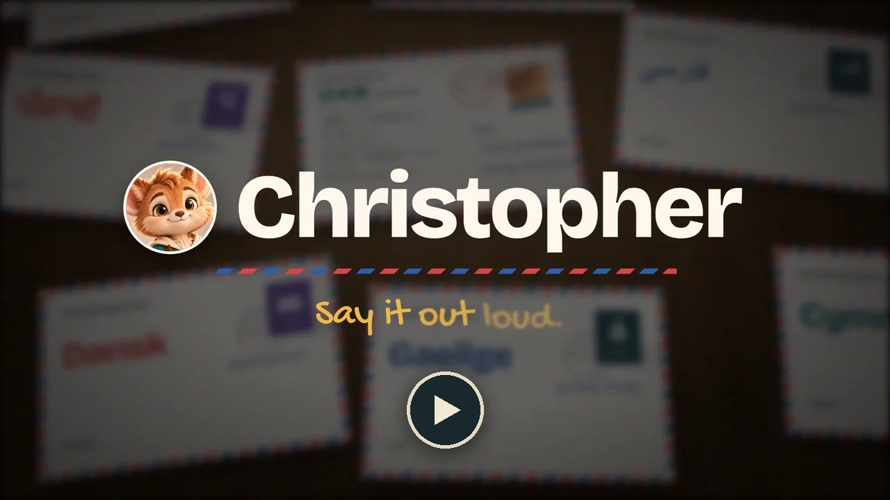
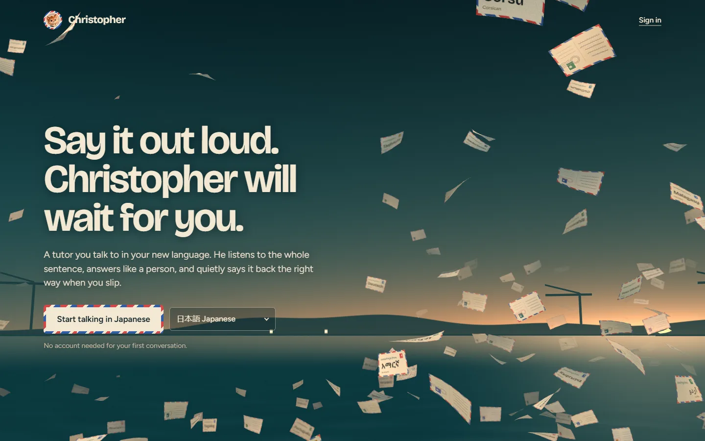
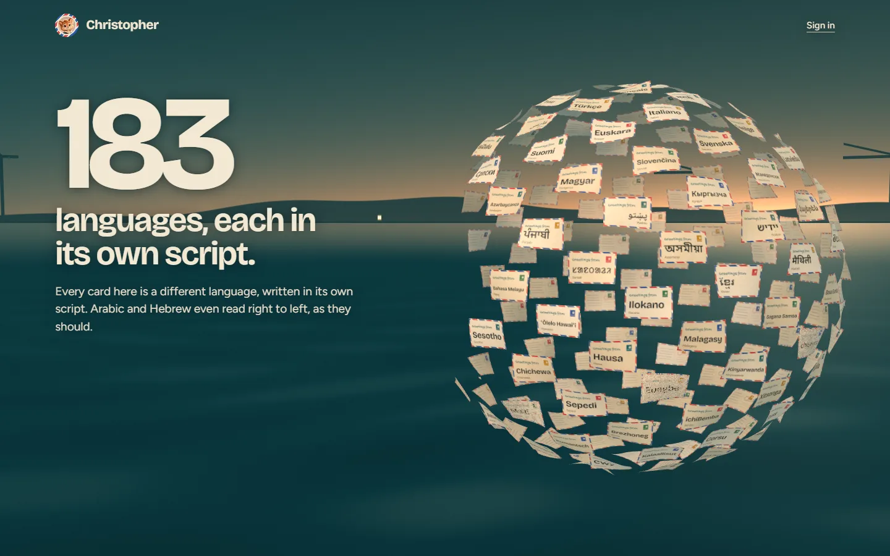
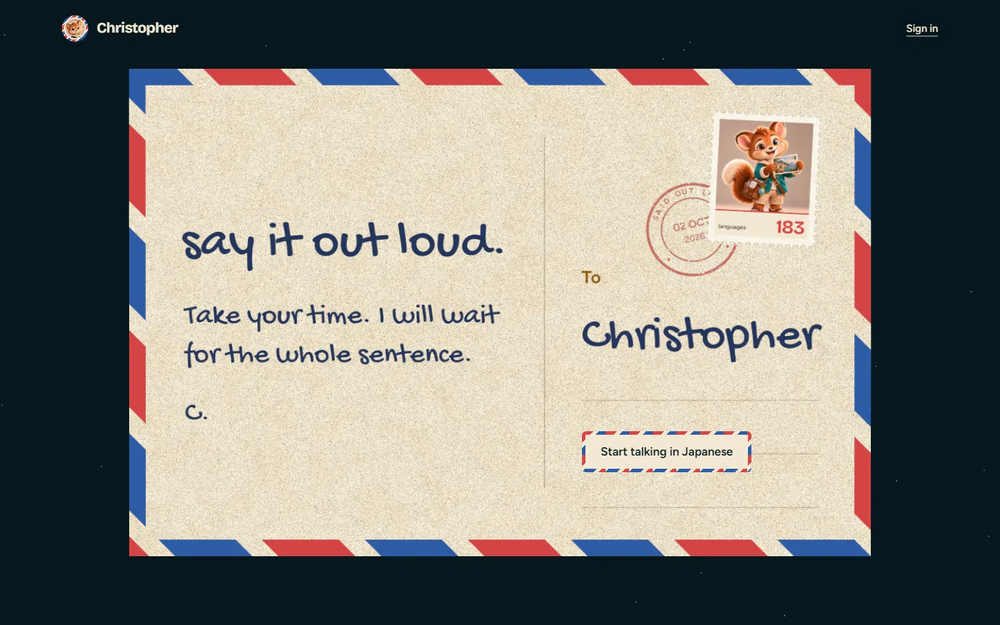
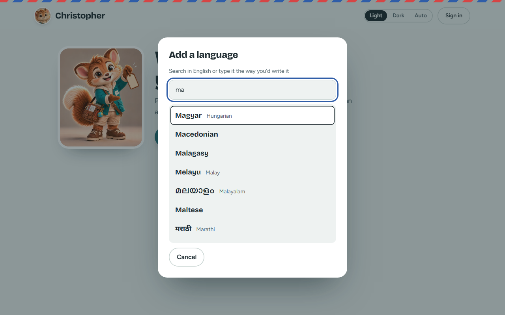
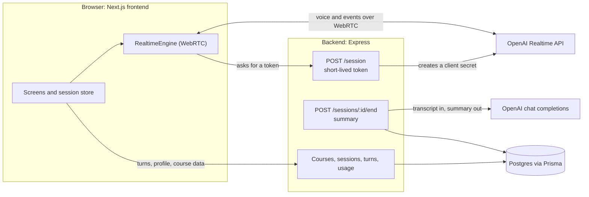
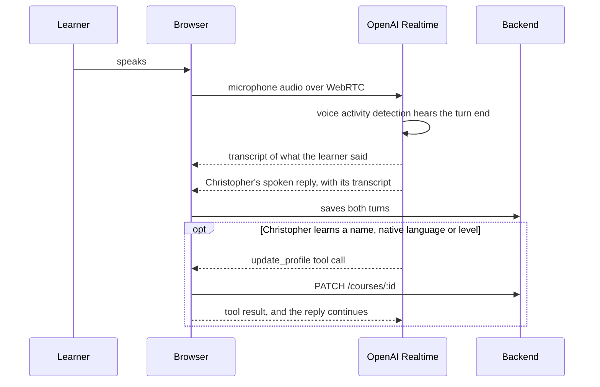

<p align="center">
  
</p>

<h1 align="center">Christopher</h1>

<p align="center">
  A voice tutor you talk to out loud, in more than 180 languages.<br />
  <a href="https://christopherai.vercel.app">Try it at christopherai.vercel.app</a>
</p>

> This project was originally developed in July 2026. I am publishing it here in August 2026 as part of sharing my past work.

## See it working

<p align="center">
  <a href="https://christopherai.vercel.app/christopher-trailer.mp4">
    
  </a>
  <br />
  <sub>The 55-second trailer, with sound. Click to play.</sub>
</p>

<p align="center">
  
  
</p>
<p align="center">
  
  <picture>
    <source media="(prefers-color-scheme: dark)" srcset="docs/screenshots/picker-dark.png" />
    
  </picture>
</p>

<!--
  Live conversation and end-of-conversation postcard: save them as
  docs/screenshots/conversation-{light,dark}.png and postcard-{light,dark}.png,
  then uncomment this row.

<p align="center">
  <picture>
    <source media="(prefers-color-scheme: dark)" srcset="docs/screenshots/conversation-dark.png" />
    
  </picture>
  <picture>
    <source media="(prefers-color-scheme: dark)" srcset="docs/screenshots/postcard-dark.png" />
    
  </picture>
</p>
-->

## What it does

You pick a language, allow the microphone, and have a spoken conversation with Christopher. He listens to the whole sentence, answers like a person, and when you slip he repeats the phrase the right way instead of marking you wrong. He learns your name, native language and level as you talk and picks up where you left off next time. When you end the conversation you get a postcard: the words you used, what to try again, and what to practise next.

- Live voice conversation in the browser over WebRTC, with a streaming transcript
- Spoken pronunciation and grammar coaching from the tutor during the conversation
- Memory per language: name, native language, level, words practised, past notes
- A welcome back by name at the start of the next conversation
- An end-of-conversation summary, and a word list with English meanings on each language's page
- A searchable picker for 183 languages, shown by their own names, including right-to-left scripts
- Works as a guest straight away; Clerk sign-in is optional
- Light and dark themes in the app, and Christopher's pose follows the conversation: listening, thinking, speaking, stepping back when you cut in
- A scroll-driven 3D landing page: airmail postcards in 183 scripts drift over a harbour at dusk, gather into a sphere you can drag, and end as a giant postcard addressed to Christopher
- A "Hear it" demo on the landing that plays a short recorded conversation in 14 languages, with subtitles

## How it works

The browser talks to OpenAI's Realtime API directly over WebRTC. The backend never relays the conversation audio; it hands out a short-lived token, stores courses and transcripts in Postgres, and writes the summary when a conversation ends.


```mermaid
flowchart LR
    subgraph browser["Browser: Next.js frontend"]
        ui["Screens and session store"]
        engine["RealtimeEngine (WebRTC)"]
    end

    subgraph api["Backend: Express"]
        token["POST /session<br/>short-lived token"]
        data["Courses, sessions, turns, usage"]
        summary["POST /sessions/:id/end<br/>summary"]
    end

    realtime["OpenAI Realtime API"]
    chat["OpenAI chat completions"]
    db[("Postgres via Prisma")]

    ui --> engine
    engine -->|"asks for a token"| token
    token -->|"creates a client secret"| realtime
    engine <-->|"voice and events over WebRTC"| realtime
    ui -->|"turns, profile, course data"| data
    data --> db
    summary -->|"transcript in, summary out"| chat
    summary --> db
```

One turn of a conversation:


```mermaid
sequenceDiagram
    participant L as Learner
    participant B as Browser
    participant O as OpenAI Realtime
    participant A as Backend

    L->>B: speaks
    B->>O: microphone audio over WebRTC
    O->>O: voice activity detection hears the turn end
    O-->>B: transcript of what the learner said
    O-->>B: Christopher's spoken reply, with its transcript
    B->>A: saves both turns
    opt Christopher learns a name, native language or level
        O-->>B: update_profile tool call
        B->>A: PATCH /courses/:id
        B-->>O: tool result, and the reply continues
    end
```

### Project layout

```text
Christopher/
├── shared/      @vta/shared: Zod schemas and TypeScript types used by both sides (raw TS, no build)
├── backend/     Express API: /session, courses, sessions, usage, /pronounce (Prisma, Postgres)
│   └── src/prompts/tutor.ts   the tutor's system prompt
├── frontend/    Next.js 15 app
│   ├── components/            landing, languages, course page, conversation, mascot
│   │   └── airmail/           the landing's WebGL scene: flock, dust, sphere, ending, preloader
│   ├── public/hear/           recorded Hear it clips, one folder per language
│   └── lib/engine/            ConversationEngine interface and the RealtimeEngine
├── services/    Python reference scorer for /pronounce (standalone, not wired in)
└── design/      scripts that export the mascot images
```

## Engineering decisions

**Short-lived tokens for browser-to-OpenAI WebRTC.** The conversation has to be low-latency, so audio goes straight from the browser to OpenAI instead of through my server. That means the browser needs a credential, and the real API key cannot leave the backend. `POST /session` creates a client secret with the session's instructions, voice and tools already set ([`session.ts`](backend/src/routes/session.ts)), and the browser uses it only for the SDP handshake ([`RealtimeEngine.ts`](frontend/lib/engine/RealtimeEngine.ts)). The trade-off: the server cannot see the live audio, so everything it needs comes back as events the client forwards.

**The server decides when a turn ends.** An earlier version had the client send `response.create` itself. Every misheard blip started a fresh reply, and the tutor would re-greet and loop. Turn detection now runs on OpenAI's server VAD with `create_response: true`, a 0.6 threshold to ignore room noise, 550 ms of silence so learners can pause mid-sentence, and 300 ms of prefix padding so short words keep their start. The learner speaks first and the client never sends `response.create` (beyond acknowledging a tool call): Christopher's greeting is his reply to their first hello, so a connection where nobody talks costs nothing. The trade-off is less control over timing in exchange for a conversation that does not trip over itself.

**Transcription locked to the language being learned.** Short target-language clips were being detected as a neighbouring language, for example Japanese transcribed as Chinese, which fed the tutor nonsense. The session uses `gpt-4o-transcribe` and pins its language when the course's language is one of the 20 names in the lookup table in `session.ts`. Other languages fall back to auto-detection.

**Memory as a tool call, not a replayed transcript.** The tutor calls `update_profile` as soon as it learns a name, native language or level; the client saves it to the course. Every conversation starts fresh, with that memory, the words practised and past notes appended to the instructions. Replaying old transcripts would cost more and drift; the trade-off is that only what's summarised carries over.

**Judging pronunciation by listening, not by transcript.** A transcript diff passes mispronunciations, because the speech-to-text model quietly corrects them. So pronunciation feedback comes from a model that hears the audio. Today that's the Realtime model itself, coaching in the conversation as the tutor prompt describes. The backend also has a separate `/pronounce` route that sends one clip to an audio model and returns an accuracy score and coaching, and `services/pronunciation/` holds a Python reference scorer with the same shape. Neither is connected to the current frontend.

**One seam for the conversation engine.** The UI talks to a small `ConversationEngine` interface ([`ConversationEngine.ts`](frontend/lib/engine/ConversationEngine.ts)): connect, interrupt, disconnect, and callbacks for status, transcript, speaking and profile. `RealtimeEngine` is the only implementation; the screens and store do not know it's OpenAI.

**Languages from the platform, not a hard-coded list.** The picker keeps only ISO 639-1 codes and asks `Intl.DisplayNames` for the English name and the language's own name ([`languages.ts`](frontend/lib/languages.ts)). That gives 183 languages with correct native spellings and no strings to maintain. The trade-off is that names follow the browser's CLDR data.

**Guest first, sign-in optional.** Every request resolves to an owner: `clerk:<userId>` from a verified Clerk token, or `guest:<uuid>` from a header the browser generates ([`owner.ts`](backend/src/owner.ts)). Nobody has to create an account to try it. Without Clerk keys, the middleware is a passthrough and the app runs guest-only. The trade-off: a guest id is just a header, so the free trial is easy to reset by clearing storage.

**A trial that's only spent once Christopher hears you.** `/session` checks the allowance but does not consume it; the client consumes one session the first time the server detects the learner's speech ([`gate.ts`](backend/src/gate.ts), rules in [`trial.ts`](backend/src/trial.ts)). A failed connect or a silent microphone never burns the learner's free conversation. As a safety net, the server counts handed-out connections where the learner was never heard: after `FREE_UNHEARD_CONNECTS` of them (4, about $0.04 at most), the next connection uses the trial up front.

**Shared contracts.** Types and Zod schemas for summaries, profiles, tokens and course data live in one workspace package, [`shared/src/index.ts`](shared/src/index.ts), imported by both sides as raw TypeScript. The backend validates the summary model's output against `SummarySchema` before saving it.

**A 3D landing that does not cost the first paint.** The landing is a WebGL scene (three.js, with GSAP ScrollTrigger and Lenis for the scroll), but those libraries are loaded with a dynamic `import()` after the page has hydrated ([`AirmailLanding.tsx`](frontend/components/AirmailLanding.tsx)). The headline, button and language menu are plain HTML that render straight away, and the landing's first-load JavaScript stayed the same size as the old page. The scene's `dispose()` tears down both WebGL contexts, the scroll triggers and every listener, so going into the app and back does not leak or stack scenes. The copy dissolving into dust is computed on the GPU from the scroll position, so scrolling back gathers it again. With reduced motion the scene snaps to still frames; without WebGL the copy shows on a flat background.

**Recorded demo clips instead of live speech.** The landing's "Hear it" plays the same short conversation in 14 languages, in which the learner slips on the past tense and Christopher answers with the right form. The clips were generated once with OpenAI text-to-speech and ship as static files in `frontend/public/hear/`, so playing them costs nothing and does not touch the API key. Generating speech on each click would be slower, billed per play, and open to abuse.

**Self-checks instead of a test framework.** Each piece of logic with real branches has a small runnable file that asserts its behaviour and needs no keys or database. They're listed under [Run it locally](#run-it-locally).

## Run it locally

### What you need

- Node.js 18.18 or later (20 or later is fine)
- A Postgres database. A free [Neon](https://neon.tech) project works.
- An OpenAI API key with access to the Realtime API
- A browser with a microphone

### Steps

```bash
git clone https://github.com/ManasBorole/Christopher.git
cd Christopher

# Installs all three workspaces; also runs `prisma generate` for the backend
npm install

# Backend settings: fill in OPENAI_API_KEY and DATABASE_URL
cp backend/.env.example backend/.env

# Frontend settings: optional, the defaults work locally
cp frontend/.env.example frontend/.env.local

# Create the tables
npm run prisma:push --workspace=backend

# Start each in its own terminal
npm run dev:backend     # API on http://localhost:8787
npm run dev:frontend    # app on http://localhost:3000
```

### What you should see

- The backend prints `backend on http://localhost:8787`, and http://localhost:8787/health returns `{"ok":true}`.
- http://localhost:3000 shows the landing page: a postcard drops in while the scene loads, then the harbour appears.
- Press **Start talking in Japanese** (or pick another language first), then **Try it as a guest**, then allow the microphone. Say hello: Christopher greets you and asks your name.

### If something goes wrong

- **The backend exits with `Missing env: OPENAI_API_KEY`** (or `DATABASE_URL`). `backend/.env` is missing a value.
- **The screen says Christopher cannot hear you.** The browser blocked the microphone. Allow it from the icon next to the address bar and press **Try again**.
- **The screen says Christopher could not connect.** Check the backend terminal. `openai_session_failed` usually means the key has no Realtime access.
- **Errors about a table that does not exist.** Run `npm run prisma:push --workspace=backend`.
- **`npm run dev` only starts the backend on Windows.** The root script uses `&`, which runs the two commands one after the other in `cmd`. Use the two terminals above.
- **"That was your free conversation."** The trial allows one 60-second conversation per owner. Raise `FREE_SESSIONS` / `FREE_SECONDS`, or add your owner id to `UNLIMITED_OWNERS` (a guest id is `guest:` plus the `vta_guest` value in the site's localStorage).

### Self-checks

These run with no keys or database:

| Command | Checks |
| --- | --- |
| `npx tsx frontend/lib/languages.selfcheck.ts` | Native names, right-to-left flags, search by English or native name |
| `npx tsx frontend/lib/sessionPhase.selfcheck.ts` | Which screen state each engine event maps to |
| `npx tsx frontend/lib/transcript.selfcheck.ts` | Dropping noise mis-transcribed as speech |
| `npx tsx frontend/lib/lastChat.selfcheck.ts` | "Last chat" wording on the course tags |
| `npx tsx frontend/lib/recorder.selfcheck.ts` | Audio downsampling and PCM encoding for clips |
| `npm run check --workspace=backend` | Backend typecheck, plus WAV wrapping and coaching thresholds for `/pronounce` |
| `pip install -r services/pronunciation/requirements.txt`<br/>`python services/pronunciation/main.py` | The Python reference scorer |

## Configuration

<details>
<summary><code>backend/.env</code></summary>

| Variable | Required | Default | What it does |
| --- | --- | --- | --- |
| `OPENAI_API_KEY` | Yes | | Realtime voice, summaries and word translations |
| `DATABASE_URL` | Yes | | Postgres connection string |
| `PORT` | No | `8787` | Port the API listens on |
| `FRONTEND_ORIGIN` | No | `http://localhost:3000` | Allowed origins, comma-separated. In development any localhost port is also allowed. |
| `OPENAI_REALTIME_MODEL` | No | `gpt-realtime` | Voice model for the conversation |
| `OPENAI_REALTIME_VOICE` | No | `alloy` | Christopher's voice |
| `OPENAI_SUMMARY_MODEL` | No | `gpt-4o-mini` | Writes summaries and translates learned words |
| `OPENAI_PRONUNCIATION_MODEL` | No | `gpt-audio-mini` | Audio model behind `/pronounce` |
| `FREE_SESSIONS` | No | `1` | Free conversations per owner |
| `FREE_SECONDS` | No | `60` | Length of each free conversation |
| `FREE_UNHEARD_CONNECTS` | No | `4` | Connections per owner where Christopher never hears the learner that stay free. The next connection uses the trial, or is refused once it is used. |
| `UNLIMITED_OWNERS` | No | | Owner ids that skip the trial, comma-separated |
| `CLERK_SECRET_KEY` | No | | Verifies signed-in users. Leave empty for guest-only. |

</details>

<details>
<summary><code>frontend/.env.local</code></summary>

| Variable | Required | Default | What it does |
| --- | --- | --- | --- |
| `NEXT_PUBLIC_BACKEND_URL` | No | `http://localhost:8787` | Where the API runs |
| `NEXT_PUBLIC_CLERK_PUBLISHABLE_KEY` | No | | Shows the sign-in buttons |
| `CLERK_SECRET_KEY` | No | | Turns on Clerk's middleware. Set it together with the publishable key. |

</details>

## Deploy

This is an npm-workspaces monorepo, and `@vta/shared` is imported as raw TypeScript, so each host has to install from the repository root for that package to resolve.

- **Frontend:** a Next.js app in `frontend/`. The live site runs on Vercel. Point the project's root directory at `frontend` and keep installs at the repository root. Set `NEXT_PUBLIC_BACKEND_URL` to the API's URL, plus the Clerk keys if you use sign-in. `.vercelignore` keeps the Python service out of the build.
- **Backend:** a Node process. Install from the root (this runs `prisma generate`), start with `npm run start --workspace=backend`, set the `backend/.env` values, set `FRONTEND_ORIGIN` to the frontend's URL, and set `NODE_ENV=production` so CORS allows only those origins.
- **Database:** run `npm run prisma:push --workspace=backend` once against the production `DATABASE_URL`.

## Limitations

- Pronunciation feedback is the conversation model's judgement by ear, not phoneme-level scoring.
- The free trial defaults to one 60-second conversation per owner, and guest owners can reset it by clearing browser storage.
- Every conversation runs on the OpenAI Realtime API, which is billed by audio usage; the trial gate is the only cost control.
- Transcription is pinned to the learned language only for the 20 language names in `session.ts`; the rest rely on auto-detection, which can confuse similar languages on short clips.
- The picker lists 183 languages, but how well Christopher teaches each one depends on the Realtime model, not on this app.
- The landing needs WebGL and is heavy on older phones; there is no lighter version beyond the reduced-motion still frames.
- The Hear it scripts were written without a native-speaker review for every language.
- I have checked the interface in Chromium. I have not verified voice conversations in Safari or Firefox for this README.

## License and author

No license is granted: all rights reserved.

Built by [Manas Borole](https://github.com/ManasBorole).
